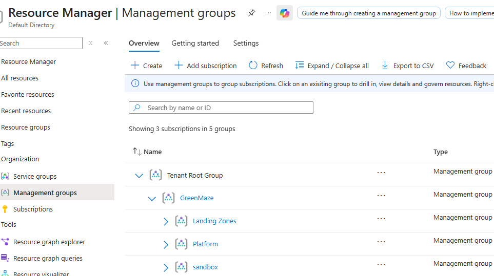

# Management group

MS Entra tenant and Azure Tenant is the same Tenant.
```text
Tenant Root Group│
├── Entra ID
│   ├── Users
│   ├── Groups
│   └── Roles
│
└── Management group GreenMaze
     │
     ├── Platform
     │
     │    ├── Management
     │    ├── Connectivity
     │    └── Identity
     │
     ├── Landing Zones
     │
     │    ├── Corp
     │    └── Online
     │
     └── Sandbox
```

Microsoft describes management groups as a governance layer above subscriptions, where Azure Policy and RBAC can be applied and inherited by the subscriptions underneath.

## The key hierarchy

Management Group → Subscription → Resource Group → Resource  

## Why do Management Groups exist?

Instead of configuring policies and permissions individually on every subscription, you can put them under a Management Group.
Then you can apply Azure Policy or RBAC at the Management Group level. The settings can then be inherited by the subscriptions underneath. 

```text
Tenant Root Group
│
└── GreenMaze
     │
     ├── Platform
     │
     │    ├── Management
     │    ├── Connectivity
     │    └── Identity
     │
     ├── Landing Zones
     │
     │    ├── Corp
     │    └── Online
     │
     └── Sandbox

Think of the Management Groups as governance boundaries, not departments.  

Microsoft specifically recommends keeping management-group hierarchies reasonably flat and says not to create management groups specifically for production, testing, and development environments; those environments can instead be separated by subscriptions under an appropriate management group.

Microsoft's landing-zone model separates the platform landing zone from application/workload landing zones. Platform resources provide centralized capabilities, while application landing zones contain workloads and their environments.

Best Practice: Microsoft recommends keeping the hierarchy flat (3 to 4 levels deep) to reduce complexity in policy inheritance and role-based access control (RBAC) management.

## 1. GreenMaze — Parent Management Group

Purpose: The overall governance container for GreenMaze.
Put policies here that should apply broadly across GreenMaze.  
For example:  
Allowed Azure regions  
Required tags  
Security baseline  
Logging requirements  
General governance  

## 2. Platform

This contains the Azure infrastructure that supports the rest of the organization.
```text
Platform
│
├── Management
├── Connectivity
└── Identity
```
Management: 
Central management services such as:  
Azure Monitor  
Log Analytics  
Automation  
Security management  
Monitoring infrastructure  
Connectivity    

Central networking:  
Hub VNet  
Azure Firewall  
VPN Gateway  
ExpressRoute  
DNS  
Network connectivity  

Identity:   
Central identity-related infrastructure where applicable.  

Microsoft's platform landing zone concept provides centralized capabilities that application teams consume.  

## 3. Landing Zones  
This is where the actual company workloads go.
```text
Landing Zones
│
├── Corp
└── Online
```
Microsoft's reference architecture uses Corp and Online as workload landing-zone archetypes.  

Corp  
For workloads that require connectivity to corporate/on-premises networks.  
For example:
GreenMaze
      │
      │ VPN / ExpressRoute
      ▼
Azure Corp Workload
Think:

Internal business applications and hybrid workloads.

Online  
For workloads that are internet-facing or don't require corporate network connectivity.

For example:  
Internet
    │
    ▼
Azure Web Application

Think:

Public-facing applications.  

## Sanbox
A sandbox is specifically for experimentation, proof-of-concepts and learning.
```text
Sandbox Management Group
        │
        ▼
Sandbox Subscription
        │
        ├── Test VM
        ├── Test Storage
        ├── Test VNet
        ├── Bicep experiments
        └── AZ-104 labs
```
Microsoft recommends putting sandbox subscriptions under a sandbox management group with less restrictive policies than production workloads.




## Management group vs subscription

```text
Management Group	Subscription
Governance boundary	Resource/admin/billing boundary
Contains subscriptions	Contains resources
Can contain child MGs	Contains Resource Groups
Policy can be applied	Policy can be applied
RBAC can be applied	RBAC can be applied
No resources directly	Resources ultimately live here
Organizes governance	Organizes Azure resources/cost
```
## Management Groups are not mandatory for every Azure deployment
This is another good exam concept.  
You can have a subscription without creating a complicated management-group hierarchy. Management groups become particularly useful when an organization has multiple subscriptions and wants centralized governance.