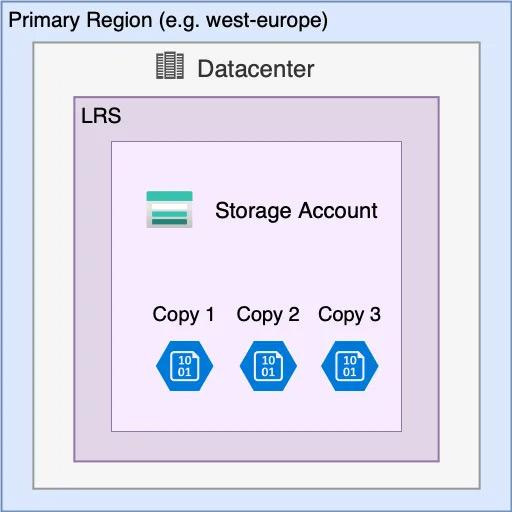

# Azure Storage
A Storage Account is the Azure resource. The storage services/data live within that account. Lets starts by identifying Azure Storage services, storage-account types, replication, access, and secure endpoints. 
```text 
| Service           | Think of it as        | Typical use                            |
| ----------------- | --------------------- | -------------------------------------- |
| **Blob Storage**  | Object storage        | Images, videos, documents, backups     |
| **Azure Files**   | Cloud file share      | Shared Windows/Linux files             |
| **Queue Storage** | Message queue         | Asynchronous application communication |
| **Table Storage** | NoSQL key/value store | Simple structured datasets             |

```
Microsoft describes Blob as object storage for unstructured data, Files as managed file shares, Queues as asynchronous messaging, and Tables as schemaless NoSQL storage.


### Storage Account Types
Microsoft currently recommends these main account types:
```text
Storage Account Types
│
├── Standard general-purpose v2
│
├── Premium block blobs
│
├── Premium file shares
│
└── Premium page blobs
```
### Performance Tiers
```text 
GPv2
 │
 ├── Blob Storage
 ├── Azure Files
 ├── Queue Storage
 └── Table Storage
```
It's the standard account type for most Azure Storage scenarios.  

- Standard  
- Premium  

Designed for workloads requiring low latency and/or high transaction rates. Premium storage uses SSD-based storage for supported account types. High-performance application, High transaction rate, Low-latency workload

For example, GPv2 is a storage account type that normally uses Standard performance, while premium account types provide specialized premium workloads.
Standard use example:  
Documents  
Backups  
Logs  
Normal application data  

Premium use example:  
High-performance application  
High transaction rate  
Low-latency workload  

### redundancy

Azure Storage redundancy means keeping multiple copies of your data so it can survive hardware failures, data-center outages, or regional disasters. The option you choose affects cost, availability, and disaster recovery.   
- LRS — Locally Redundant Storage   

Stores three copies of your data within a single physical data center in the primary region.  
Protects against drive and server failures.  
Doesn't protect adequately against a data-center disaster.  
Best for data that can be recreated or where lower cost is the priority.   

- ZRS — Zone-Redundant Storage  
Replicates data synchronously across separate availability zones within the same region.  
Protects against an availability-zone outage.  
Data remains available for reads and writes during a zone outage, subject to service recovery.  
Doesn't protect against a complete regional outage.  

- GRS — Geo-Redundant Storage  
Keeps redundant copies in the primary region and asynchronously replicates data to a secondary geographic region.  
Protects against a regional disaster.  
The secondary copy isn't directly readable during normal operation.  
A failover is required to use the secondary region as the primary.  

- GZRS — Geo-Zone-Redundant Storage    
Combines ZRS in the primary region with asynchronous replication to a secondary region.  
Protects against an availability-zone outage.  
Also protects against a regional disaster.  
The secondary copy isn't directly readable until failover.  

- RA-GRS — Read-Access Geo-Redundant Storage  
Provides GRS plus read access to the secondary region.  
Applications can read from the secondary without waiting for a failover.  
The secondary copy is asynchronously replicated and can lag behind the primary.  
Read access doesn't mean you can normally write to the secondary.  

- RA-GZRS — Read-Access Geo-Zone-Redundant Storage  
Provides GZRS plus read access to the secondary region.  
Protects against zone and regional outages.  
Allows reads from the secondary region without failover.  
Combines zone resilience, geographic resilience, and secondary read access.  

And remember: GRS and GZRS replicate to the secondary asynchronously, so the secondary may not contain the latest writes when a disaster occurs. Redundancy alone also doesn't protect you from accidental deletions or malicious changes.

## Storage Security
Azure Storage security is about controlling who can access your data, how they connect to it, and how the data is protected.

Access Keys and Key Rotation
A storage account has two access keys, named key1 and key2. They are powerful credentials that can authorize requests to data across the storage account using Shared Key authorization. example:  
```text
Storage Account: stgdev01
        │
        ├── key1
        └── key2
```  
Think of each key as a master credential. Anyone who obtains one may be able to access the account's data, so don't embed keys in source code or store them in plain text. They allow you to rotate credentials without interrupting your applications.  
Key rotation example  
Your application currently uses key1.   
Update the application to use key2 and verify that it works.  
Regenerate key1 to invalidate the old key.  
When needed, repeat the process in reverse to rotate key2.  
 
Shared Access Signatures (SAS)  
For example, you want a customer to download one PDF without giving them your storage account key.  
You can create a SAS that permits:  
One specific blob  
Read-only access  
Access until a specified expiry time  
HTTPS connections only  
The customer can then use the SAS URL without receiving your account key.  

There are three SAS types:  
User delegation SAS     Signed using Microsoft Entra credentials; preferred for Blob Storage when SAS is needed  
Service SAS     Delegates access to a specific storage service/resource  
Account SAS	    Can delegate access across supported services in the account  

Service SAS and account SAS are signed using the account key. User delegation SAS uses Microsoft Entra credentials. 
    Remember: A SAS is a bearer credential. Anyone who obtains the URL may be able to use it within its permissions and validity period. Keep permissions narrow and expiry short.  
Storage Firewalls and Virtual Network Rules

Storage firewalls control where network connections to the public endpoint may originate.

For example, GreenMaze might allow access only from its office's public IP address or selected Azure virtual network subnets.
```text
Office IP ──────────┐
                    ▼
              Storage Firewall
                    │
                    ▼
             Storage Account

Unknown IP ──X──> Blocked
```
You can configure network rules to allow selected IP addresses, virtual networks using supported network configurations, and certain trusted Azure services or resource instances.

Important: being allowed by the firewall does not grant data permissions. The user or application must still authenticate and be authorized. 
Microsoft Learn
+1

8.8.5 Private Endpoints

A private endpoint connects a supported storage service to a private IP address in your Azure virtual network using Azure Private Link.

Instead of relying on a publicly accessible endpoint, your Azure VM can connect to the storage service privately.

GreenMaze Virtual Network

VM: 10.0.1.4

Private Endpoint

Private IP: 10.0.2.5

Azure Storage Account

Blob service, for example

A private endpoint does not automatically disable the storage account's public endpoint. If you want private-only access, configure public network access and firewall settings accordingly. DNS must also resolve the storage service's hostname to the appropriate private endpoint IP. 
Microsoft Learn
+1

Firewall vs. Private Endpoint

Firewall: Restricts which sources can reach the public endpoint.

Private endpoint: Provides private IP connectivity to the storage service.

Both: Can be part of a defense-in-depth design.

8.8.6 Encryption and HTTPS

Encryption protects data in two different situations.

Encryption at rest

Protects stored data on the underlying storage infrastructure. Azure Storage encrypts data at rest by default; supported scenarios can use customer-managed keys.

Encryption in transit

HTTPS uses TLS to protect data as it travels between clients and Azure Storage. Enable Secure transfer required to reject HTTP requests.

Microsoft recommends requiring secure transfer and using TLS 1.2 or later.
### 8.9 Azure Blob Storage
- Containers
- Blobs
- Access tiers
- Lifecycle management
- Versioning
- Soft delete
- Snapshots
- Object replication

### 8.10 Azure Files
- File shares
- SMB
- NFS
- Snapshots
- Soft delete
- Identity-based access

### 8.11 Storage Tools
- Azure Storage Explorer
- AzCopy

### 8.12 Data Protection
- Encryption
- Soft delete
- Versioning
- Replication