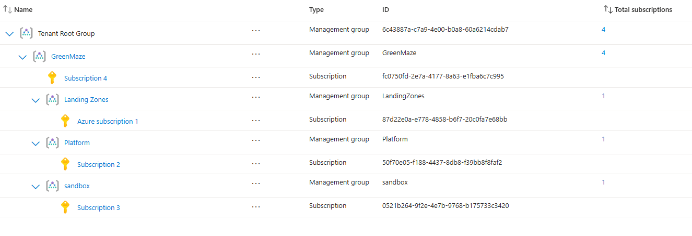

## Subscriptions
An Azure subscription is a container that Azure uses to organize and manage resources.  

You still need subscriptions for things like:  
Billing  
Resource deployment  
Resource quotas/limits  
Access boundaries  
Separating environments  

The subscription contains Azure resources:  
VMs  
Storage  
Networks  
Databases  
Web Apps  
Key Vaults  
etc.  

## Why would a company have multiple subscriptions?
A company doesn't necessarily put everything into one giant subscription. Example:  
```text
GreenMaze
│
├── Platform Subscription
│
├── Production Subscription
│
├── Development Subscription
│
├── Sandbox Subscription
│
└── Security Subscription
```

Security  
You can isolate workloads.  
Billing  
You can track costs separately.  
Access control  
Different administrators can have different access.  
Quotas  
Azure resource quotas are often subscription-scoped.  
Governance  
Different Azure Policy requirements can be applied.  
Lifecycle  
You can manage environments independently.  

## Subscription name vs Subscription ID  
These are different.  
Name: Human-friendly  
Unique identifier: 87d22e0a-e778-4858-b6f7-20c0fa7e68bb  

## Subscription is an ARM boundary
Azure Resource Manager (ARM) manages Azure resources.

```text
Management Group
       ↓
Subscription
       ↓
Resource Group
       ↓
Resource
```
You can assign Azure RBAC at different scopes.

## Common built-in subscription roles  
Owner - Can manage everything, including access.  
Contributor - Can manage resources but cannot normally assign Azure RBAC roles.  
Reader - Can view resources but can't modify them.  

## Azure subscription and Microsoft Entra roles
Microsoft Entra roles:  
Global Administrator  
User Administrator  
Groups Administrator  

