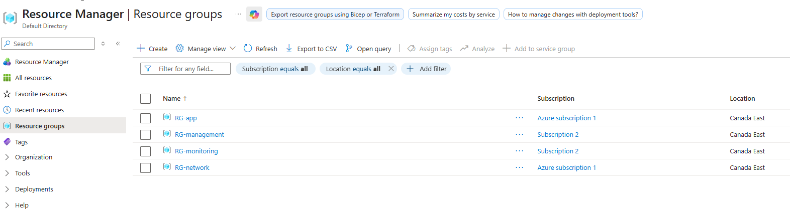

## resource group 
A Resource Group is a container that lets you organize and manage related Azure resources.  


```text
Microsoft Entra Tenant
│
└── Management Group
    │
    └── GreenMaze
        │
        ├── Platform
        │   └── Subscription
        │
        ├── Landing Zones
        │   └── Subscription
        │
        └── Sandbox
            └── Subscription
                │
                └── Resource Groups
                    │
                    ├── rg-network
                    ├── rg-compute
                    ├── rg-storage
                    └── rg-security
                        │
                        └── Azure Resources
                            ├── VM
                            ├── VNet
                            ├── Storage Account
                            └── etc.
```
The RG doesn't provide the actual service.  
The VM, VNet, Storage Account, etc. are the resources.

## Resource Group belongs to a subscription
A Resource Group cannot exist independently of a subscription.
RG is like a folder for managing related Azure resources.
## 3. A Resource Group can contain resources from different services
```text
rg-webapp
│
├── App Service
├── App Service Plan
├── Application Insights
├── Key Vault
└── Storage Account
```
A Resource Group isn't limited to one type of Azure service.

## A Resource Group can contain resources from different regions
```text
rg-az104
│
├── VM
│   └── Canada Central
│
├── Storage Account
│   └── Canada East
│
└── Key Vault
    └── Canada Central
```
A Resource Group itself does not force all resources to be in the same Azure region. However, individual resources have their own location/region requirements.

## Resources can belong to only one Resource Group
A resource cannot simultaneously belong to two Resource Groups at the same time. You can move a resource to another Resource Group, subject to the service's move limitations. Not every Azure resource supports moving in every situation. You should know that moving a resource can have requirements and restrictions, and sometimes dependent resources need to be moved together.A Resource Group can be empty
A Resource Group can contain many resources. This is normal
rg-app-production
│
├── VM01
├── VM02
├── NIC01
├── NIC02
├── Disk01
├── Disk02
├── Load Balancer
└── Public IP

## Deleting a Resource Group
If you delete a Resource Group Azure also deletes the resources contained in that Resource Group.
```text 
rg-production
│
├── VM
├── Storage
└── VNet

        ↓ DELETE RG

Everything is deleted
```

## Resource Groups are useful for RBAC

You can assign Azure RBAC at the Resource Group level. They can manage resources inside that RG. But they don't automatically get Contributor access to the entire subscription.  

This is an important use of least privilege.

Resource Groups can inherit RBAC from higher scopes

# Resource Groups can have locks

You can put a management lock on a Resource Group.  

## Two important locks:

CanNotDelete

Resources can be modified but the scope cannot be deleted.

ReadOnly

The scope becomes read-only.

## Resource Groups can have tags
You can tag Resource Groups. Example  
```text 
Environment = Production
Department = IT
Owner = CloudTeam
CostCenter = IT-001
Project = GreenMaze
```
Tags are useful for: Organization, Cost reporting, Automation, Governance, Inventory

## Resource Groups have a location
When creating a Resource Group, Azure asks you for a region/location. But that does not mean all resources inside it must be in Canada Central. The RG's location is used for storing metadata associated with the Resource Group.  
The resources have their own locations.

A Resource Group belongs to one subscription.

Storage Account names have stricter naming/uniqueness requirements than Resource Groups.
You need to learn the naming rules of the specific service. Resource Group names must be unique only within the subscription

Resource Groups are mainly for organizing and managing resources within a subscription. 

⭐ COMMANDS TO RECOGNIZE Azure CLI:  
``` text
az group create
az group show
az group list
az group delete
az group update
```

⭐ Azure PowerShell:
```text
New-AzResourceGroup
Get-AzResourceGroup
Remove-AzResourceGroup
Set-AzResourceGroup
```

## Resource Group scope
RBAC, Policy, and locks can be applied at different scopes.

