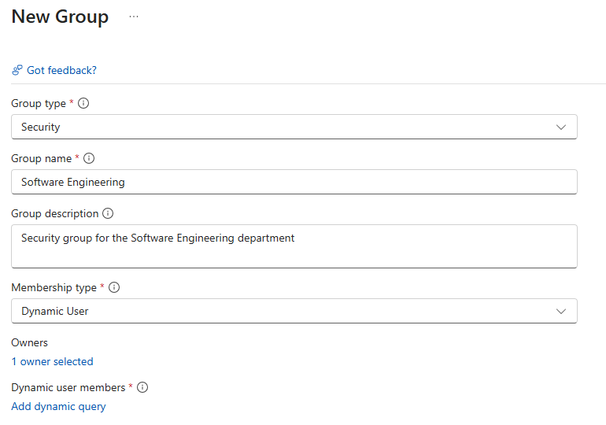

# Microsoft Entra Admin Center

GUI  
Entra > Users > New user > Create new user or Invite external user
```text
│
└── Users
    │
    └── New user
        │
        ├── Create new user
        │
        └── Invite external user
```
## Create new user individually

Display Name: The user's friendly, full name as it appears in the organization's directory.

Principal Name (User Principal Name / UPN): The unique sign-in identifier and email-like address used by the user to authenticate and access the directory.

Department and location are IMPORTANT to add for RBAC

## Create new user with Group-Based Management (Recommended)

## Step 1: Create a Template Security Group

Go to Identity > Groups > All groups.
```text
Microsoft Entra ID
        │
        ▼
      Groups
        │
        ├── Group type
        │      │
        │      ├── Security
        │      │     → Used to control access to resources,
        │      │       applications, Azure roles, etc.
        │      │
        │      └── Microsoft 365
        │            → Used for collaboration (shared mailbox,
        │              Teams, SharePoint, calendar, etc.).
        │
        └── Membership type
               │
               ├── Assigned
               │     → Admin manually adds/removes members.
               │
               ├── Dynamic User
               │     → Users are automatically added/removed
               │       based on user attributes/rules.
               │
               └── Dynamic Device
                     → Devices are automatically added/removed
                       based on device attributes/rules.
```

## Group type
Security groups are commonly used for access management.


Select New group. 
Group type: Select Security  
Group name: Choose a descriptive name (e.g., Sales Team - Standard Access).  
Membership type: <span style="color:green">Assigned User</span>  
Click Create.



Pick Assigned if: You don't have Entra ID P1/P2 licenses, your team is small, or membership doesn't follow a logical rule based on user attributes.

Pick Dynamic if: Every new user in a specific department/title needs access automatically as soon as their profile is created.
<span style="color:red">****Dynamic membership in Microsoft Entra ID requires Microsoft Entra ID P1 or P2>Assigned User</span>

The important distinction is:

Assigned = you manage membership.  
Dynamic User = Entra manages users based on rules.  
Dynamic Device = Entra manages devices based on rules.  

## Step 2: Add the template group to your management structure

User → Security Group → Permissions/Access
The security group becomes the reusable template. Instead of assigning permissions individually to every user, you put the user in the appropriate group.

Step 3: Create the user  
Microsoft Entra admin center → Identity → Users → All users → New user  
Display name: Luc 
User principal name: Luc.Plante@company.com  
Job title: Software Engineering Manager  
Department: Software Engineering  