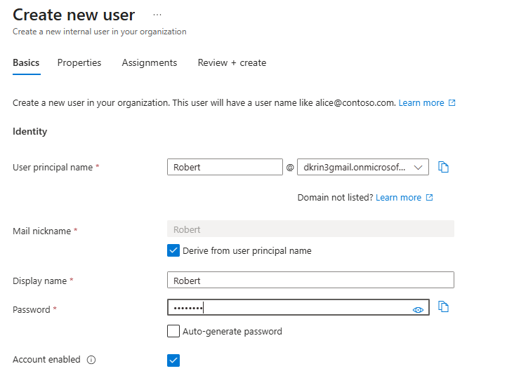

# Microsoft Entra Admin Center

GUI 
Entra - Users - New user - 
Microsoft Entra ID

```text
│
└── Users
    │
    └── New user
        │
        ├── Create new user
        │
        └── Invite external user

```
Display Name: The user's friendly, full name as it appears in the organization's directory .   

Principal Name (User Principal Name / UPN): The unique sign-in identifier and email-like address used by the user to authenticate and access the directory.



